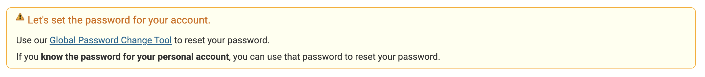
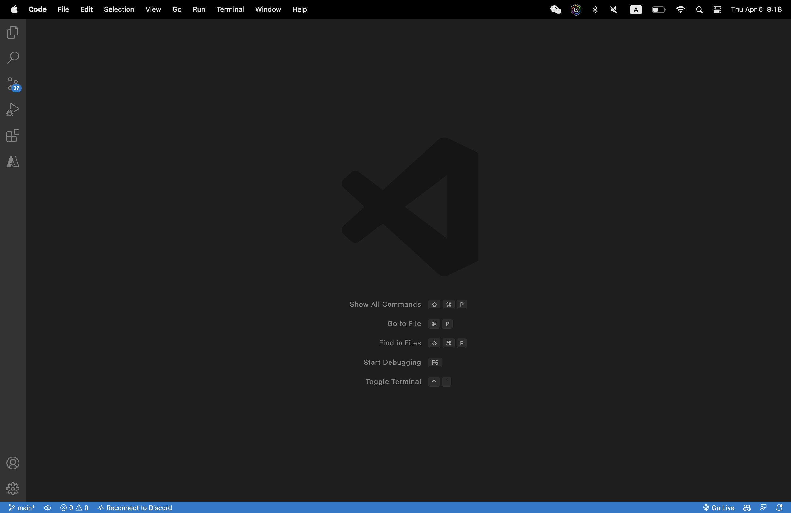
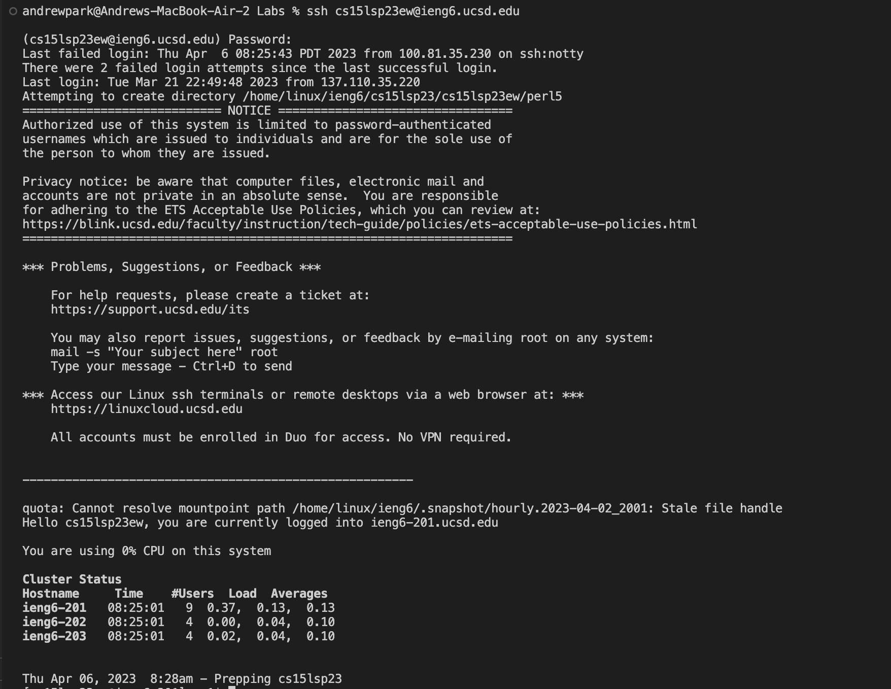
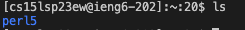
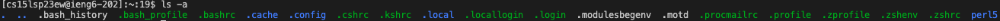

# How to Connect Remotely

The lab of CSE 15L requires all students to work in remote servers. Therefore, knowing how to connect your computer remotely is important.

## Step 1: Set the Password for Your CSE 15L Account

Go to this website to set or reset your password for your CSE 15L account:

[Set/Reset CSE 15L Account Password](https://sdacs.ucsd.edu/~icc/index.php)

First, log in with your UCSD email username and your student PID. Then, you will see "Additional Accounts" below your username. Click cs15l account, and you see a box saying: "Let's set the password for your account."



Click "Global Password Change Tool" in the box and follow the instructions to change your set your password.

You are done setting up your CSE 15L Account!

## Step 2: Install Visual Studio Code

To download VS Code, visit this link and follow the instructions for installation:

[Download VS Code](https://code.visualstudio.com/download)

VS Code is also installed in all the computers in the lab, so personal laptops are not required in this lab.

When you first start VS Code, the window will look like this:



## Step 3: Use Terminal to Connect Remotely

Before starting to connect remotely through VS Code terminal, **Window** users must install and set up `git bash` in Visual Studio Code. Follow the instructions and set up 'git bash' through this link:

[Set up Git for Windows](https://gitforwindows.org/)

**Mac** users, don't worry. `git` is already built in your terminal.

After setting up `git`, open a terminal in Visual Studio Code (Under "Terminal", click "New Terminal"). Type the following command in the terminal and replace `ab` with the letters in your username and press enter:

`$ ssh cs15lsp23ab@ieng6.ucsd.edu`

You **should not** type `$` in your terminal because it is just to notify people how to wirte commands.

When it is your first time connecting remotely, this message will be printed:

```
The authenticity of host 'ieng6.ucsd.edu (128.54.70.227)' can't be established.
RSA key fingerprint is SHA256:ksruYwhnYH+sySHnHAtLUHngrPEyZTDl/1x99wUQcec.
Are you sure you want to continue connecting (yes/no/[fingerprint])?
```

Do not get panic and just type "yes" and press enter. Then, you will see this output:

```
# Now on remote server
quota: No filesystem specified.
Hello cs15lsp23ab, you are currently logged into ieng6-203.ucsd.edu

You are using 0% CPU on this system

Cluster Status
Hostname     Time    #Users  Load  Averages
ieng6-201   23:25:01   0  0.08,  0.17,  0.11
ieng6-202   23:25:01   1  0.09,  0.15,  0.11
ieng6-203   23:25:01   1  0.08,  0.15,  0.11

Thu Apr 06, 2023 8:28am - Prepping cs15lsp23
```

Here is a screenshot of a successful output:



If you see this output in the termial, you have successfully connected remotely to the computer in the CSE Building basement. Now, the basement computers are _server_ and your computer is _client_.

You can exit the remote environment by Command or Ctrl + D, or you can type `exit` in the terminal.

## Step 4: Running Different Commands

In your remote environment, you can still use the commands you usually on your computer, such as `cd`, `ls`, and others. When you first connect to the remote environment, your `pwd` is `/home/linux/ieng6/cs15lsp23/cs15lsp23zzz`. `zzz` is the letters in your usernames.

- You can view the list of files and folders using `ls`.



- You can view the list of **all** files using `ls -a`.



- You can move through directories using `cd <directory>`.
- You can print the contents of a file using `cat`.
