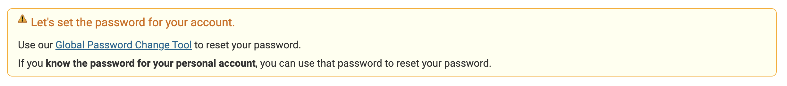

# How to Connect Remotely
The lab of CSE 15L requires all students to work in remote servers. Therefore, knowing how to connect your computer remotely is important. 
## Step 1: Set the Password for Your CSE 15L Account
Go to this website to set or reset your password for your CSE 15L account: 

[Set/Reset CSE 15L Account Password](https://sdacs.ucsd.edu/~icc/index.php)

First, log in with your UCSD email username and your student PID. Then, you will see "Additional Accounts" below your username. Click cs15l account, and you see a box saying: "Let's set the password for your account."

