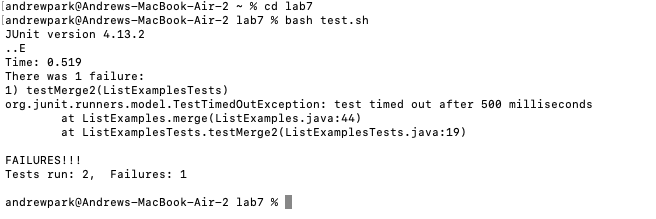
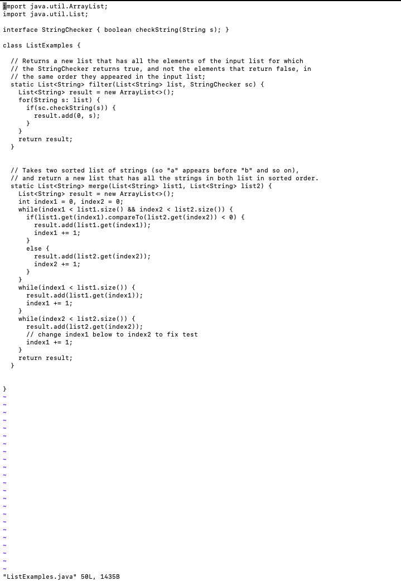
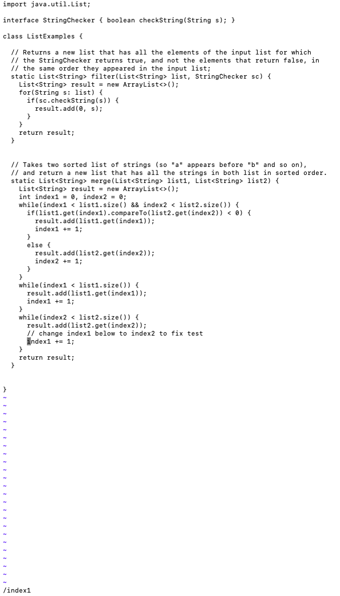
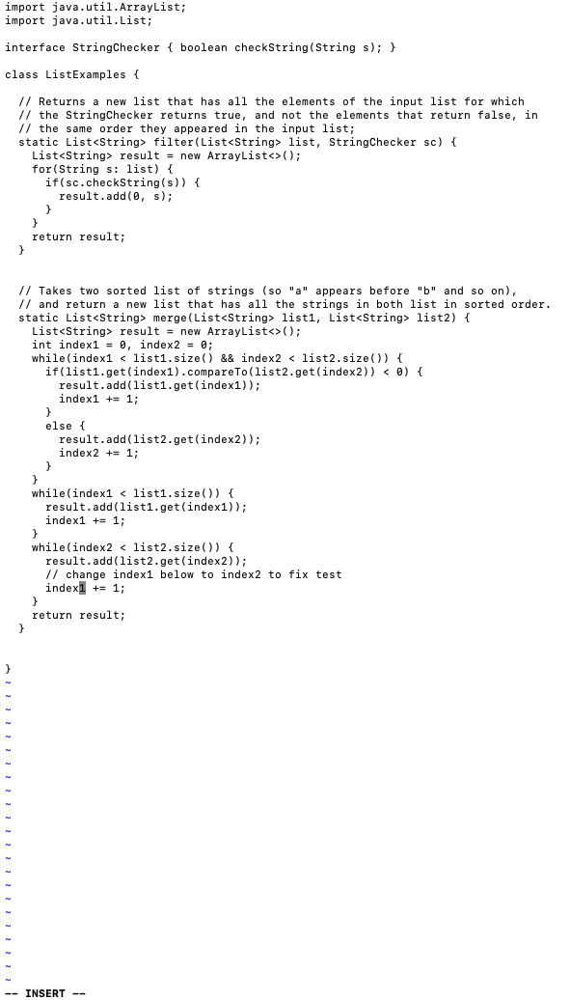
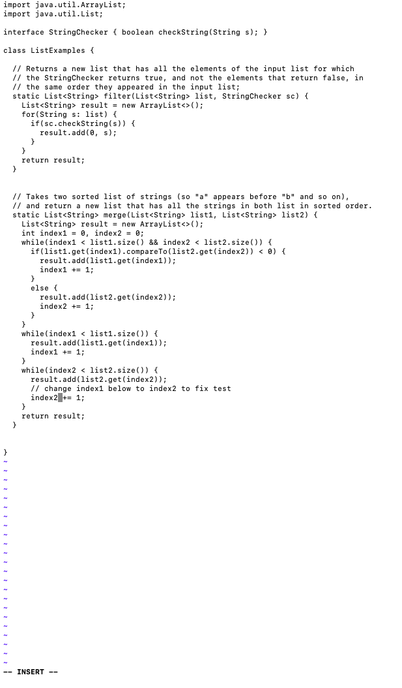
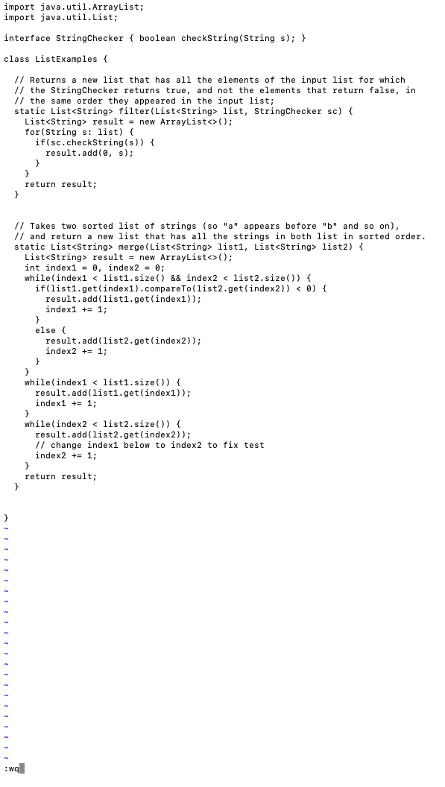
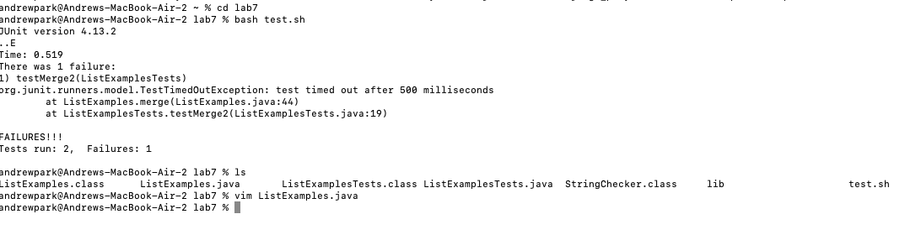

# How to Use Vim 101

## Step 1: Log in to ieng6

Since logging in to your ieng6 is a complex process, pressed `<ctrl> + R` and typed `ssh` to look up a command line that logs in to my ieng6 account.

> output after presssing `<ctrl> + R` then `ssh`

Then press `<enter>` to run the command.

(If you did not generate and add your SSH key to your ieng6 account you have to type your password)

## Step 2: Clone your fork of the repository from your Github account.

I copied the Github repository URL from Github, which is `<cmd> + C`

`https://github.com/ucsd-cse15l-s23/lab7`: This is the repository URL.

Then I open, the terminoal and type: `git clone` and `<space>` and then `<cmd> + V`

`git https://github.com/ucsd-cse15l-s23/lab7`
and typed `<enter>`

> output after typing `git clone ` and then `<cmd> + v`

## Step 3: Run the tests, demonstrating that they fail.

After cloning, I type `cd l` and then `<tab>` and `<enter>` to go into the Lab7 directory.

> Output: `cd lab7`

Then, I type `bash t` and `<tab>` and type `<enter>`

> output after `bash test.sh` + `<enter>`

This output indicates that the tests failed.

## Step 4: Edit the code file to fix the failing test

Open vim by typing `vim Lis` and `<tab>` and `j` and `<tab>` and `<enter>`. Then the command line will be:

`vim ListExamples.java`

> output after `vim Lis` and `<tab>` and `j` and `<tab>` and `<enter>`

By typing `/index1`, I looked for the variable index1 in the java file. Then, type `n` several times until you get to the last `index1`

> outupt after typing `/index1` and `n`s until the last occurence of index1.

Type `e` to go to the end of the word `index1`. Then, open insert mode by typing i.

> output after typing `e` and then `index1`

Then, press `<right>` and then `<backspace>` and `2` to change `index1` to `index2`.

Lastly press `<esc>` to exit the Insert Mode

> output after pressing `<right>` -> `<backspace>` -> `2`

Exit vim by pressing `:` and `w` and `q` to save and exit vim

> output after typing `:wq`

### Step 5: Run the tests, demonstrating that they now succeed

Then, I type `bash t` and `<tab>` and type `<enter>`
