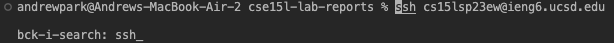

# How to Use Vim 101

## Step 1: Log in to ieng6

Since logging in to your ieng6 is a complex process, pressed `<ctrl> + R` and typed `ssh` to look up a command line that logs in to my ieng6 account.

> output after presssing `<ctrl> + R` then `ssh`

Then press `<enter>` to run the command.

(If you did not generate and add your SSH key to your ieng6 account you have to type your password)

## Step 2: Clone your fork of the repository from your Github account.

I copied the Github repository URL from Github, which is `<cmd> + C`

`https://github.com/ucsd-cse15l-s23/lab7`: This is the repository URL.

Then I open, the terminoal and type: `git clone` and `<space>` and then `<cmd> + V`

`git https://github.com/ucsd-cse15l-s23/lab7`
and typed `<enter>`

> output after typing `git clone ` and then `<cmd> + v`
