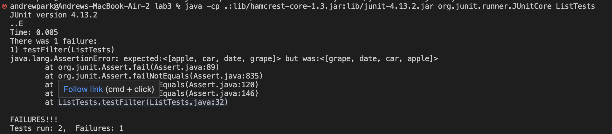
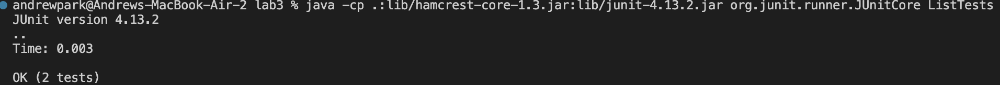

# Part 1

This is how I created `StringServer` webpage.

First I had to copy and paste the `Server.java` file from lab 2 Github repository. Then, I had to compile the `Server.java` file before compiling `StringSever.java`. 

The code below is what I wrote for the `StringServer.java`. 

```
import java.io.IOException;
import java.net.URI;

class StringHandler implements URLHandler {
    String message = "";

    public String handleRequest(URI url) {
        System.out.println(url);
        if (url.getPath().equals("/")) {
            return "Andrew Park's Homepage";
        } else if (url.getPath().equals("/add-message")) {
            String[] parameters = url.getQuery().split("=");
            if (parameters[0].equals("s")) {
                message += parameters[1];
                message += "\n";
            }
            return message;
        } else {
            return "404 Not Found";
        }
    }
}

class StringServer {
    public static void main(String[] args) throws IOException {
        if (args.length == 0) {
            System.out.println("Missing port number! Try any number between 1024 to 49151");
            return;
        }
        int port = Integer.parseInt(args[0]);
        Server.start(port, new StringHandler());
    }
}
```

## Images of the Webpage and Explanations


### Start Method
When the website is started, the main method in the StringServer class, and the main method takes in an array of string values of our argument in the terminal. Then the `start` method in the `Server` class is initiated in order to activate the server. This method takes in the integer value of the port number ranging from 1024 to 49151. 

### handleRequest Method
When the server starts new URIHandler called `StringHandler` is initiated. In this class, `handleRequest` method is called in the `ServerHttpHandler` class when running the webpage. This method takes URI, which is a url of the webpage. The if statement determines the path of the webpage and display the right output of the webpage. The `String` value of `message` field variable in the `StringHandler` class stores the query of string value that the user typed after "localhost:4000/add-message" (4000 is the port number that I chose). 

### getQuery and getPath Methods
Within the `StringHandler` class, `getQuery` and `getPath` methods are called. The `getQuery` takes no parameters but returns a string that the user types for query (after "?" in the URL). The `getPath` also takes no parameters and returns a string that the user type for path (after "/" but before "?" in the URL). 

Becuase of thie request by the path `/add-message`, the string value of message is changed from no content to "hello" because the query has a string value of "hello" and the `handleRequest` method adds the value "hello" and "\n" to the empty message field variable. 


### Start Method
This time `start` method in the `Server` class is not called because the server is already on.

### handleRequest Method
Again, the `handleRequest` method is called in the `ServerHttpHandler` class when running the webpage. This method takes URI, which is a url of the webpage. The if statement determines the path of the webpage and display the right output of the webpage. The `String` value of `message` field variable in the `StringHandler` changes during the method call. 

### getQuery and getPath Methods
Within the `StringHandler` class, `getQuery` and `getPath` methods are called. Both methods do not take parameters. 

Becuase of thie request by the path `/add-message`, the string value of message is changed from "hello" to "hello\nHow are you" because the query has a string value of "How are you" and the `handleRequest` method adds the value "How are you" and "\n" to the message field variable. 


# Part 2
`ListExamples` file is chosen for bug analysis. 

## Filter Method
When the parameter ArrayList has a length of greater than 1, there is a symptom of the bug. The elements in the returned ArrayList are not sorted as it is sorted in the original ArrayList that is taken as a parameter. 

```
    @Test
    public void testFilter() {
        StringChecker sc = new StringChecker() {
            public boolean checkString(String s) {
                return s.contains("a");
            }
        };

        ArrayList<String> failedList = new ArrayList<String>(
                Arrays.asList("apple", "beer", "car", "date", "egg", "fish", "grape"));
        ArrayList<String> expected = new ArrayList<String>(Arrays.asList("apple", "car", "date", "grape"));
        assertEquals(expected, ListExamples.filter(failedList, sc));

        ArrayList<String> workingList = new ArrayList<String>(Arrays.asList("apple"));
        ArrayList<String> expected2 = new ArrayList<>(Arrays.asList("apple"));
        assertEquals(expected2, ListExamples.filter(workingList, sc));
    }
```



The input of ArrayList named `failedList` test creates a failure, indicating a bug in the code in the `filter` method. 

On the other hand, the input ArrayList with only one element works as expected. In other words, the elements that satiates the conditions of the `StringChecker` object in the paramter ArrayList is sorted the same way as the original ArrayList. 

### Before fixing the bug
```
  static List<String> filter(List<String> list, StringChecker sc) {
    List<String> result = new ArrayList<>();
    for (String s : list) {
      if (sc.checkString(s)) {
        result.add(0, s);
      }
    }
    return result;
  }
```

### After fixing the bug
```
  static List<String> filter(List<String> list, StringChecker sc) {
    List<String> result = new ArrayList<>();
    for (String s : list) {
      if (sc.checkString(s)) {
        result.add(s);
      }
    }
    return result;
  }
```


I deleted 0 as a paramter for the add method in the for loop. Before I fixed the code, each time the if statement finds the element that satisfies the `StringChecker` conditions, the element is added to the 0th index of the result ArrayList. This makes a result ArrayList with elements that satiate the condition in the `StringChecker` object in reverse order. Therefore, by not taking 0 as the first parameter in the add method, the element is added at the end of the ArrayList. 

# Part 3
During the lab 2 and 3, I learned and took away numerous contents related to coding. Although I had some prior experience with Java before, I did not expect that Java can make webpages. Lab 2 facilitated me to learn more about the codes and logics to make a simple website with different queries and paths. 